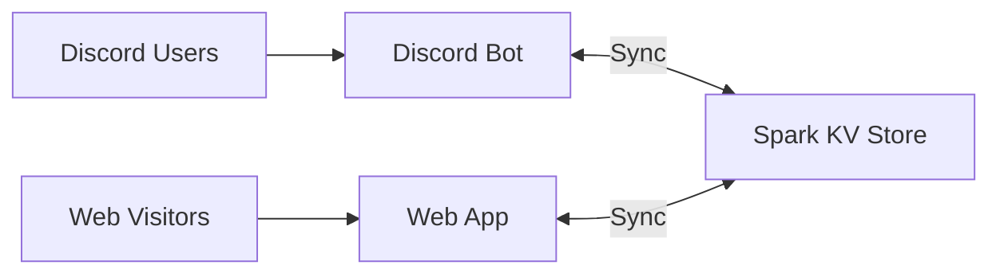

# Azure Community Platform

**あなたたちは全員ここにいていい** _(You all belong here)_

<div align="center">

### 🎯 Interactive Rules Learning • 🤖 Discord Bot • 🧠 AI-Powered Insights

A complete community management system with XP tracking, role customization, and intelligent assistance.

</div>

---

## 🚀 New User? Start Here!

<table>
<tr>
<td width="50%">

### 📘 **First Time Setup**
**→ [HOW_TO_USE.md](./HOW_TO_USE.md)**

Complete guide covering:
- ✅ Web app usage
- ✅ Discord bot setup
- ✅ Railway deployment
- ✅ Feature walkthrough
- ✅ Troubleshooting

</td>
<td width="50%">

### ⚡ **Quick Reference**
**→ [QUICK_REFERENCE.md](./QUICK_REFERENCE.md)**

Essential info:
- 📋 All commands
- ⌨️ Environment setup
- 🔑 Getting credentials
- 📊 XP system formula
- 🎭 Available roles

</td>
</tr>
</table>

---

## 📚 Documentation Hub

<table>
<tr>
<td width="33%">

### 🎓 **Getting Started**
- **[HOW_TO_USE.md](./HOW_TO_USE.md)**  
  *Complete setup guide*
  
- **[QUICK_REFERENCE.md](./QUICK_REFERENCE.md)**  
  *Commands & quick tips*
  
- **[discord-bot/QUICKSTART.md](./discord-bot/QUICKSTART.md)**  
  *Bot setup in 5 minutes*

</td>
<td width="33%">

### 🔧 **Technical Docs**
- **[ARCHITECTURE.md](./ARCHITECTURE.md)**  
  *System architecture & data flow*
  
- **[discord-bot/INTEGRATION.md](./discord-bot/INTEGRATION.md)**  
  *Integration details*
  
- **[PRD.md](./PRD.md)**  
  *Product requirements*

</td>
<td width="33%">

### 🆘 **Support**
- **[TROUBLESHOOTING.md](./TROUBLESHOOTING.md)**  
  *Fix common issues*
  
- **[PROJECT_README.md](./PROJECT_README.md)**  
  *Full feature overview*
  
- **[AI_FEATURES.md](./AI_FEATURES.md)**  
  *AI capabilities guide*
  
- **[RANK_CARD_DOCUMENTATION.md](./RANK_CARD_DOCUMENTATION.md)**  
  *Rank card setup & usage*

</td>
</tr>
</table>

---

## ⚡ Quick Start

### Web Application (Already Running!)
```bash
npm install && npm run dev
# Open http://localhost:5173
```

### Discord Bot (Deploy to Railway)
```bash
cd discord-bot
npm install
cp .env.example .env
# Edit .env with Discord credentials
npm run deploy-commands
npm run dev
```

**📖 Full instructions:** [HOW_TO_USE.md](./HOW_TO_USE.md) • **🚂 Railway guide:** Section "Deployment to Railway"

---

## ✨ What's Included

<table>
<tr>
<td width="50%">

### 🌐 **Web Application**
- 📚 Interactive rule learning system
- 🎮 Knowledge quizzes with scoring
- 🏆 Progress tracking dashboard
- 🤖 AI-powered insights & recommendations
- 💬 AI chatbot for rules Q&A
- ✨ AI profile summary generator
- 📈 AI activity analysis
- 🎭 Role customization interface
- 📊 Beautiful profile cards
- 🎴 **Real-time Discord rank cards** ⭐ NEW
- ☕ Ko-fi donation integration

</td>
<td width="50%">

### 🤖 **Discord Bot**
- 👋 Auto member role assignment
- 📜 Interactive rules display
- ⚡ Message-based XP system
- 🎯 4-tier rank progression
- 🏆 XP leaderboards
- 🎭 Role synchronization
- 💾 Shared data storage
- 🔄 Auto-reconnection handling
- 📱 Slash commands

</td>
</tr>
</table>

---

## 🎮 Discord Commands

```bash
/profile [@user]        # View profile with XP, level, and rank
/leaderboard [limit]    # Show top members (default: 10)
/rules                  # Display rules with agreement button
/roles                  # Get role customization link
/reconnect              # Re-register interactions (admin)
```

---

## 📊 XP & Ranking System

**Formula:** `level = floor(sqrt(xp / 100))`

| Rank | Level | XP Required | Icon |
|------|-------|-------------|------|
| Accordian | 0-14 | 0 - 19,600 | 🥉 |
| Arcadia | 15-29 | 22,500 - 84,100 | 🥈 |
| Apex | 30-49 | 90,000 - 240,100 | 🥇 |
| Legendary | 50+ | 250,000+ | 👑 |

**Earning XP:** 10 XP per message • 60-second cooldown

---

## 🏗️ Architecture



Both systems share data through Spark KV Store for real-time synchronization.

**Detailed architecture:** [ARCHITECTURE.md](./ARCHITECTURE.md)

---

## 🎭 Available Roles

### Interest & Personality
☆ଓ｡ Cutie ｡ଓ☆ • Dreamer • Community Fan • Thinker • Smart • Luminelle • Archeborne

### Talent & Contribution  
Rising Star • Gifted • Artist • Creator • Translator

### Core Membership
Dream Maker (auto-assigned) • Member • Pre-Member

**Customize roles:** Use `/roles` in Discord or visit the web app

---

## 🤖 AI Features

All powered by GPT-4o-mini via Spark SDK:

- **💡 Personal Insights** - Encouragement and milestone tracking
- **🎭 Role Recommendations** - Smart suggestions based on activity
- **💬 Rules Assistant** - Interactive Q&A chatbot
- **✨ Profile Summary** - Auto-generate engaging bios
- **📈 Activity Analysis** - Personalized growth tips

**Learn more:** [AI_FEATURES.md](./AI_FEATURES.md)

---

## 🚂 Deployment Options

<table>
<tr>
<td width="33%" align="center">

### Railway.com
**Recommended**
```bash
railway login
railway init
railway up
```
✅ Free tier available  
✅ Auto-scaling  
✅ Simple setup

</td>
<td width="33%" align="center">

### Docker
**Self-hosted**
```bash
docker-compose up -d
```
✅ Full control  
✅ Any host  
✅ Included config

</td>
<td width="33%" align="center">

### Node.js
**Manual**
```bash
npm run build
npm start
```
✅ Simple  
✅ Direct control  
✅ Easy debugging

</td>
</tr>
</table>

**Step-by-step guides:** [HOW_TO_USE.md → Deployment](./HOW_TO_USE.md#deployment-to-railway)

---

## 🔧 Configuration

Required environment variables:

```env
DISCORD_TOKEN=your_bot_token          # From Developer Portal
DISCORD_CLIENT_ID=your_client_id      # From Developer Portal
DISCORD_GUILD_ID=your_server_id       # Right-click server → Copy ID
WEBAPP_URL=https://azuret.me          # Your domain
WEBAPP_API_KEY=your_secure_key        # Any random string
```

**Getting credentials:** [QUICK_REFERENCE.md → Getting Discord Credentials](./QUICK_REFERENCE.md#getting-discord-credentials)

---

## 🆘 Troubleshooting

| Issue | Quick Fix | Details |
|-------|-----------|---------|
| Bot not responding | `npm run deploy-commands` | [Troubleshooting → Section A](./TROUBLESHOOTING.md#section-a-bot-not-responding) |
| Commands not found | Check invite URL & intents | [Troubleshooting → Section B](./TROUBLESHOOTING.md#section-b-commands-not-found) |
| XP not updating | Enable Message Content Intent | [Troubleshooting → Section C](./TROUBLESHOOTING.md#section-c-xp-not-updating) |
| Roles not working | Fix role hierarchy | [Troubleshooting → Section D](./TROUBLESHOOTING.md#section-d-roles-not-working) |

**Full troubleshooting guide:** [TROUBLESHOOTING.md](./TROUBLESHOOTING.md)

---

## 📁 Project Structure

```
.
├── HOW_TO_USE.md              👈 Complete setup guide
├── QUICK_REFERENCE.md         📋 Commands & quick tips
├── TROUBLESHOOTING.md         🔧 Fix common issues
├── ARCHITECTURE.md            🏗️ System architecture
├── PROJECT_README.md          📚 Full documentation
├── PRD.md                     📝 Product requirements
│
├── src/                       🌐 Web application
│   ├── App.tsx
│   ├── components/            UI components
│   └── lib/                   Utilities & types
│
└── discord-bot/               🤖 Discord bot
    ├── QUICKSTART.md          5-minute setup
    ├── INTEGRATION.md         Integration details
    └── src/                   Bot source code
```

---

## 🎯 Next Steps

### ✅ Setup Checklist
1. Read [HOW_TO_USE.md](./HOW_TO_USE.md)
2. Set up Discord bot credentials
3. Deploy bot to Railway
4. Create required roles in Discord
5. Test with `/profile` command
6. Share web app with members

### 🚀 Optional Enhancements
- Customize colors in `src/index.css`
- Modify rules in `src/lib/rules.ts`
- Add custom roles
- Enhance AI prompts
- Create achievements

---

## 📄 License

MIT License - Copyright GitHub, Inc.

---

<div align="center">

**Built with ❤️ for the Azure Community**

[Setup Guide](./HOW_TO_USE.md) • [Quick Reference](./QUICK_REFERENCE.md) • [Troubleshooting](./TROUBLESHOOTING.md) • [Architecture](./ARCHITECTURE.md)

</div>
